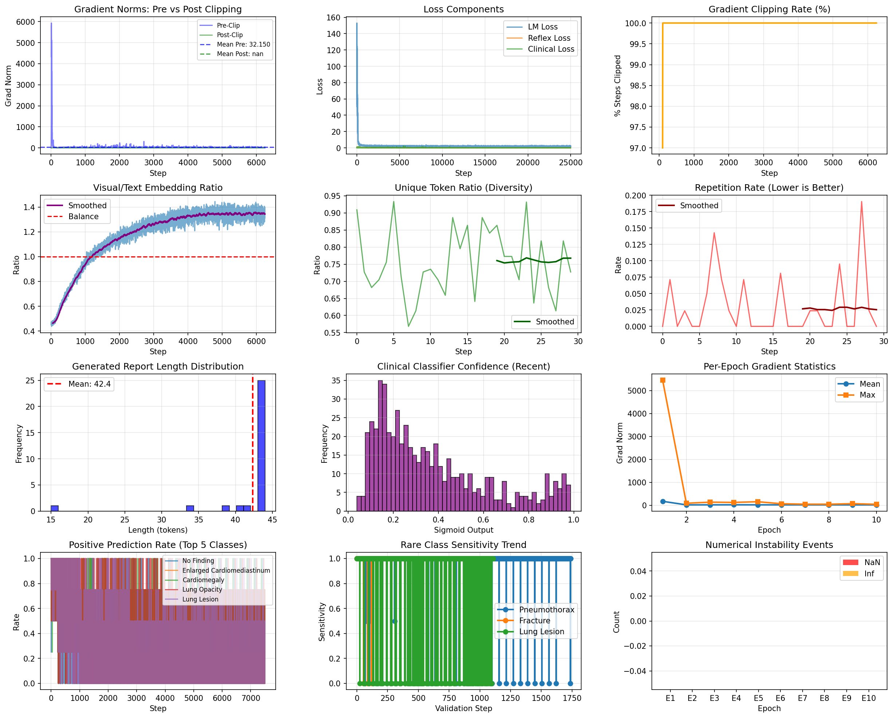
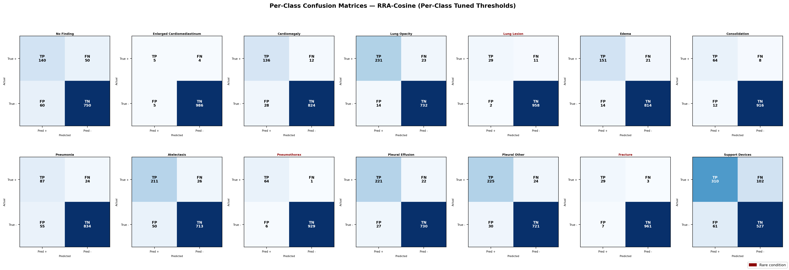

## Reflexive Radio Adapter (RRA)

Reference implementation for a multimodal radiology reporting system that combines:
- A vision encoder (ResNet50 backbone)
- A language model with LoRA fine-tuning
- A reflexive reconstruction objective for visual-text grounding
- A clinical multi-label head (CheXpert style labels)

This repository is prepared for conference artifact publication with reproducible training and evaluation entry points.

## Repository Layout

- `training/train_model.py`: training pipeline
- `training/log.py`: metrics tracking and plotting
- `evaluation/evaluate_model.py`: evaluation pipeline and report generation metrics
- `requirements.txt`: Python dependencies
- `assets/`: static images safe to version and reference in docs
- `data/`: placeholder directory for local dataset mount or metadata

## 1) Environment Setup

### Python
- Recommended: Python 3.10+

### Create environment

```bash
python -m venv .venv
source .venv/bin/activate
pip install --upgrade pip
pip install -r requirements.txt
```

### Hardware
- GPU strongly recommended for training/evaluation with quantized LLM
- If using `bitsandbytes`, ensure CUDA and PyTorch compatibility

## 2) Data Requirements

Expected metadata CSV columns:
- `image_path`
- `report`
- `clinical_labels`
- `complexity`

Expected metadata files:
- `metadata/train.csv`
- `metadata/val.csv`
- `metadata/test.csv`

Do not commit protected clinical data or PHI to this repository.

## 3) Training

Training script now supports CLI overrides for publish-ready reproducibility.

```bash
python training/train_model.py \
	--data_source /path/to/mimic_root \
	--local_data /path/to/local_cache \
	--output_dir outputs/run_001 \
	--vision_checkpoint /path/to/biovil_t_image_model_proj_size_128.pt \
	--model_id google/gemma-2b \
	--epochs 10 \
	--batch_size 4 \
	--grad_accumulation 4 \
	--learning_rate 5e-6 \
	--proj_lr 5e-5 \
	--vision_lr 1e-5 \
	--seed 42
```

Optional explicit CSV paths:

```bash
python training/train_model.py \
	--train_csv /path/to/train.csv \
	--val_csv /path/to/val.csv \
	--output_dir outputs/run_002
```

### Training Outputs
- `outputs/<run>/training.log`
- `outputs/<run>/checkpoints/`
- `outputs/<run>/metrics/`

## 4) Evaluation

The evaluation script supports two protocols for setting the classification decision thresholds.

### Option A: Zero-Leakage Protocol (Recommended)
Tuning thresholds on the test set is a form of data leakage. To evaluate under a scientifically rigorous zero-leakage protocol:

1. **Extract optimal decision thresholds on the validation set**:
   ```bash
   python evaluation/evaluate_model.py \
   	--checkpoint_dir outputs/run_001/checkpoints/best \
   	--vision_ckpt /path/to/biovil_t_image_model_proj_size_128.pt \
   	--data_root /path/to/mimic_root \
   	--val_csv /path/to/val.csv \
   	--output_dir outputs/run_001/val_thresholds \
   	--gen_samples 0
   ```
   This will save the validation-tuned thresholds into `outputs/run_001/val_thresholds/eval_results.json`.

2. **Evaluate on the test set using those validation thresholds**:
   ```bash
   python evaluation/evaluate_model.py \
   	--checkpoint_dir outputs/run_001/checkpoints/best \
   	--vision_ckpt /path/to/biovil_t_image_model_proj_size_128.pt \
   	--data_root /path/to/mimic_root \
   	--val_csv /path/to/test.csv \
   	--output_dir outputs/run_001/evaluation \
   	--threshold_file outputs/run_001/val_thresholds/eval_results.json \
   	--gen_samples 1000 \
   	--batch_size 8 \
   	--num_workers 2
   ```

### Option B: Test-Set Optimized Protocol (Outdated)
If you wish to optimize thresholds directly on the test set (which results in optimistically biased metrics):
```bash
python evaluation/evaluate_model.py \
	--checkpoint_dir outputs/run_001/checkpoints/best \
	--vision_ckpt /path/to/biovil_t_image_model_proj_size_128.pt \
	--data_root /path/to/mimic_root \
	--val_csv /path/to/test.csv \
	--output_dir outputs/run_001/evaluation_test_opt \
	--gen_samples 1000 \
	--batch_size 8 \
	--num_workers 2
```

### Evaluation Outputs
- `eval_results.json`
- `generation_samples.json`
- `per_class_metrics.csv`
- `evaluation_log.txt`

## 5) Results Visuals

These figures are tracked in `assets/` for documentation, while raw/generated metrics remain outside version control.

### Comprehensive Metrics



### Confusion Matrix Grid



## 6) Reproducibility Notes

- Seed is explicitly configurable (`--seed`) in training.
- Runtime logs capture key hyperparameters and paths.
- Keep dependency versions pinned for camera-ready artifact releases.
- Record checkpoint hash and commit hash in your experiment tracker.

## 7) Model Weights & Reproducibility

Due to GitHub's storage limits, the trained LoRA adapters, Q-Former weights, and projection layers are hosted securely on Hugging Face:

**[TigerInSuit/Reflexive-Radio-Adapter on Hugging Face](https://huggingface.co/TigerInSuit/Reflexive-Radio-Adapter)**

**Data Access Note:** While the model architecture and weights are open-source (Gemma Terms of Use), training and evaluating this model requires the **MIMIC-CXR dataset**. You must independently obtain credentialed access via [PhysioNet](https://physionet.org/) to download the X-rays and reports.

## 8) Suggested Release Process

1. Verify scripts run from a clean clone.
2. Ensure no private data or large checkpoints are committed.
3. Tag a release version.
4. Archive exact environment and evaluation outputs used in paper tables.

## 9) Citation

If you use this codebase, please cite:

```bibtex
@software{rra2026,
	title   = {Reflexive Radio Adapter (RRA)},
	author  = {Aaditya Chaturvedy and Mangalagowri R and Soubraylu Sivakumar and Deeban Chakravarthy V},
	year    = {2026},
	url     = {https://github.com/AadityaChaturvedy/Reflexive-Radio-Adapter}
}
```

## 10) License

This project is licensed under the MIT License. See `LICENSE`. The model weights are released under the Gemma Terms of Use, and the data requires PhysioNet access.

